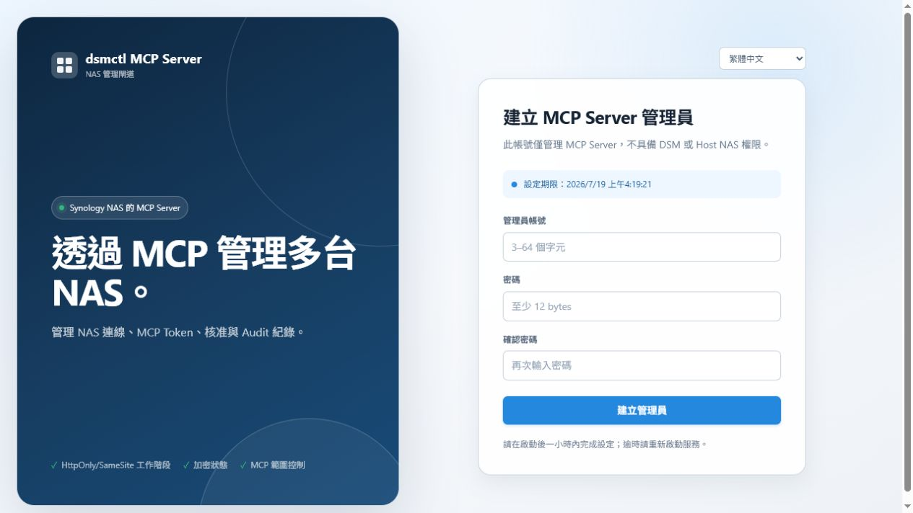
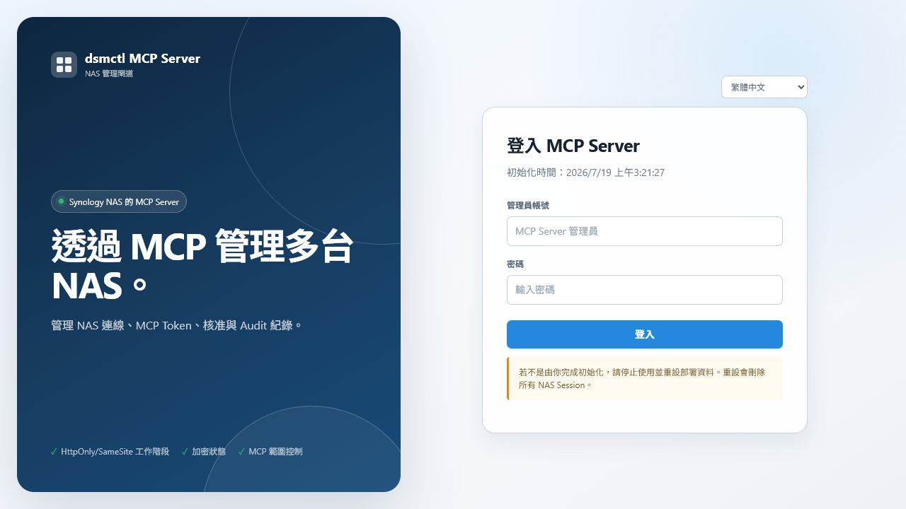
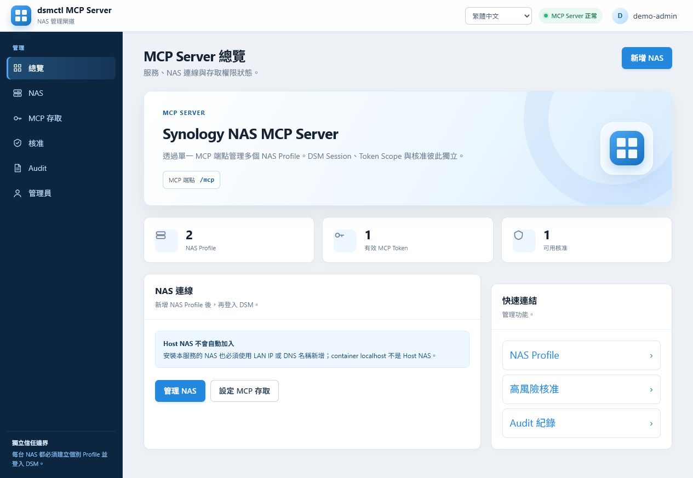
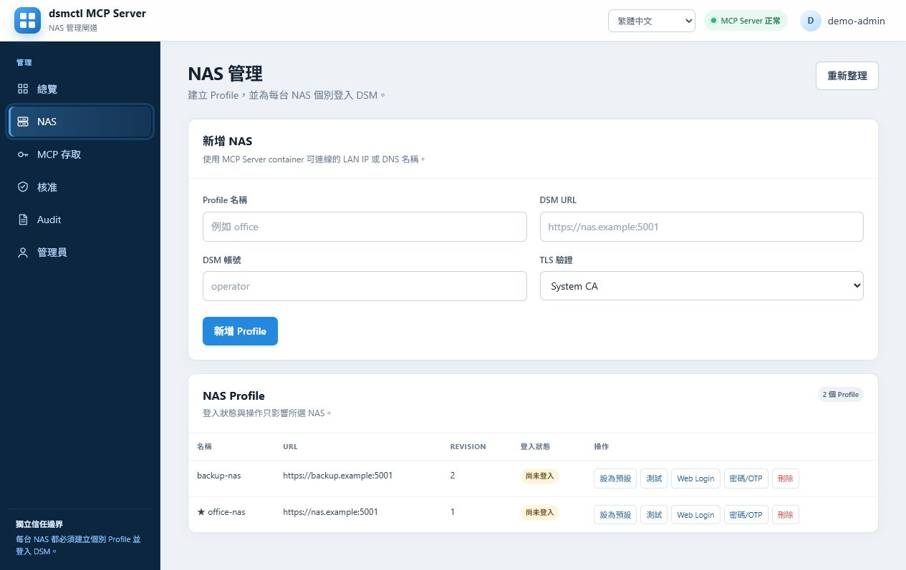
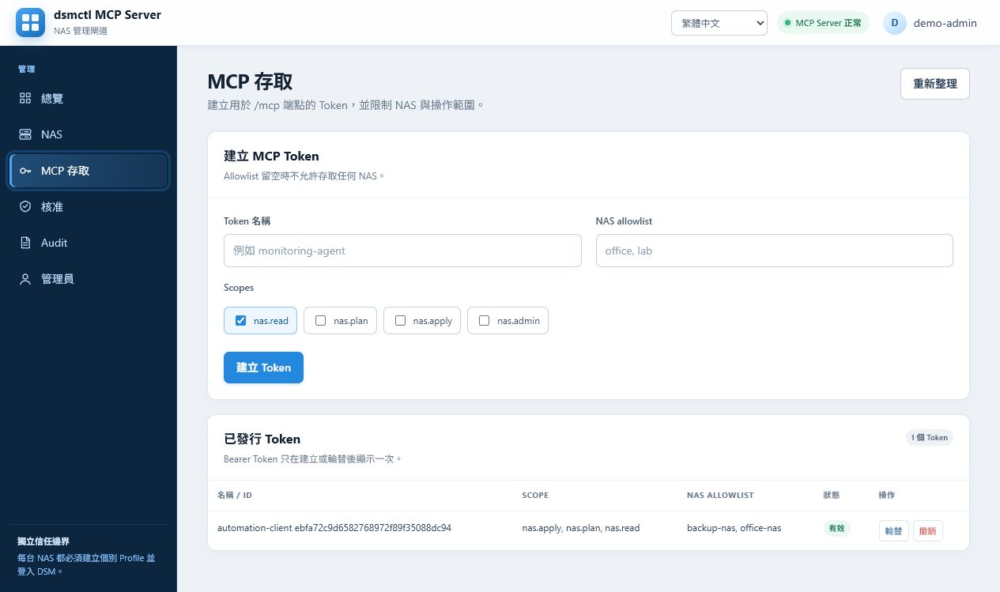
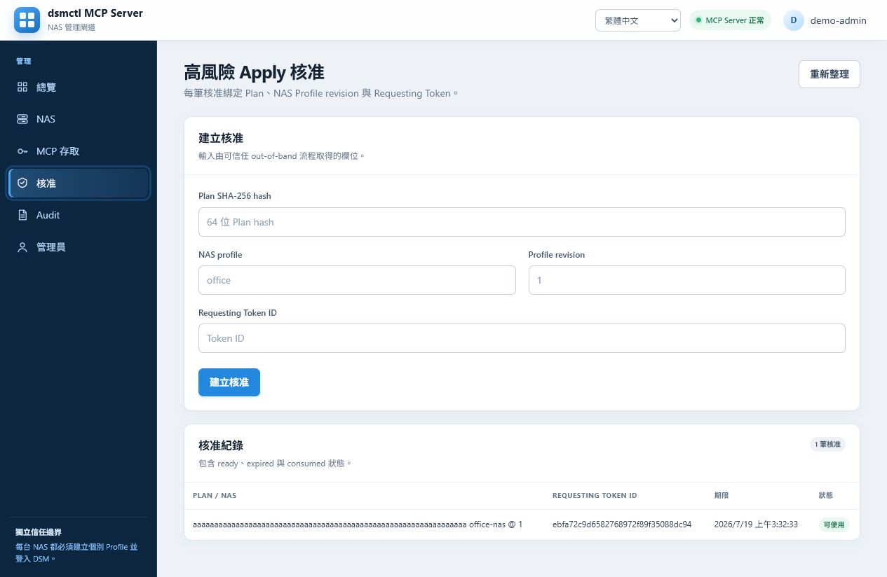
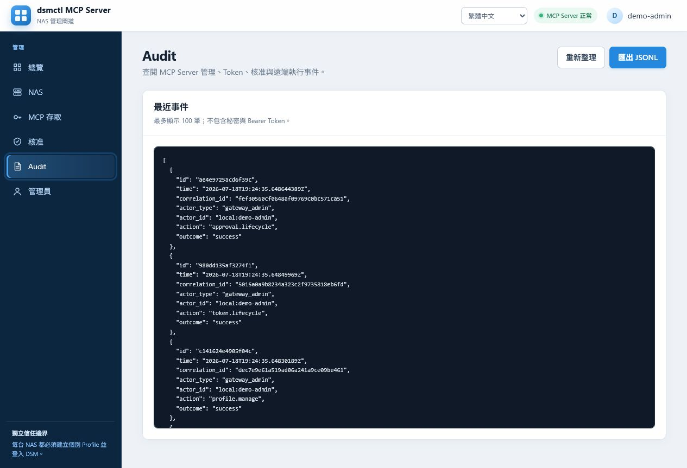
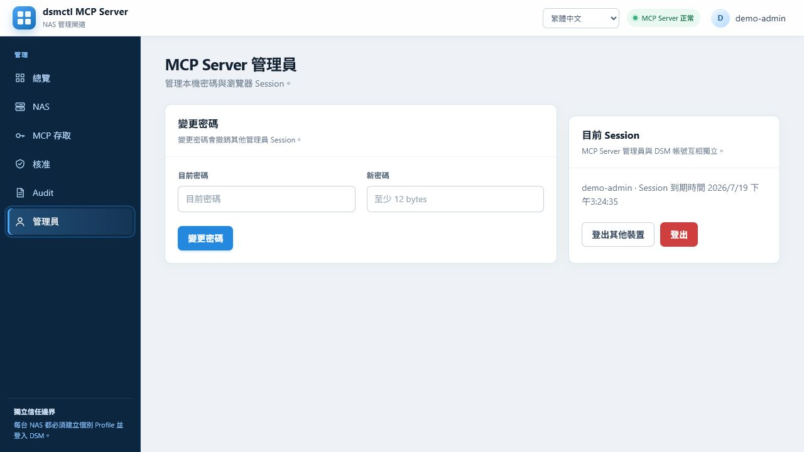

# dsmctl MCP Server 管理介面指南

這個介面管理的是 **dsmctl MCP Server**，不是 DSM 本身。MCP Server
管理員、每台 NAS 的 DSM 帳號，以及 MCP 用戶端 Token 是三個彼此獨立的
信任邊界。

## 1. 第一次初始化

1. 開啟 `http://<gateway-host>:<port>/admin/`。
2. 在服務啟動後一小時內建立 MCP Server 管理員。密碼至少 12 bytes。
3. 若設定期限已過，重新啟動尚未初始化的 container 或套件，再完成設定。

這個管理員只可進入 MCP Server 管理介面，不會自動取得 Host NAS 或其他
DSM 的權限。如果第一次開啟時已顯示完成初始化，而且不是你執行的，請停止
使用並清除該部署的 Gateway 資料後重新初始化。

## 2. 登入與語言

使用第一步建立的本機管理員登入。登入頁與管理介面右上角都可切換 English、
繁體中文、简体中文、日本語與 Deutsch；語言偏好不屬於登入狀態。

## 3. 新增與登入 NAS

1. 前往「NAS 管理」，輸入容易辨識的 Profile 名稱。
2. 輸入 container 可連線的 DSM URL，例如 `https://192.168.1.20:5001`，
   以及該 NAS 的 DSM 帳號。
3. 選擇 TLS 驗證：正式 CA 使用 `System CA`；自簽憑證使用
   `Pinned fingerprint` 並核對 SHA-256 fingerprint。
4. 建立 Profile 後，對該列執行 `Web Login`，或以「密碼/OTP」完成登入。
5. 按「測試」確認連線；需要時可將其中一台設為預設 NAS。

每台 NAS 都必須個別新增、個別登入。即使 MCP Server container 跑在
Synology NAS 上，也不會自動知道或信任 Host NAS；請用該 NAS 的 LAN IP
或 DNS 名稱新增它，`localhost` 只代表 container 自己。

## 4. 建立 MCP Token

前往「MCP 存取」，設定 Token 名稱、NAS allowlist 與最小必要 Scope：

- `nas.read`：讀取 allowlist 內 NAS 的狀態與資料。
- `nas.plan`：建立變更計畫，但不執行。
- `nas.apply`：套用已建立的計畫。
- `nas.admin`：允許 LAN 探索等管理級操作。

Allowlist 留空代表不能存取任何 NAS。Bearer Token 只在建立或輪替後顯示
一次，請立即保存到 MCP 用戶端的秘密儲存區。用戶端連至 `/mcp`，並送出：

```http
Authorization: Bearer <token>
```

## 5. 核准高風險操作

高風險 Apply 需要管理員另外建立一次性核准。從受信任的流程取得 Plan 的
SHA-256 hash、NAS Profile、Profile revision 與發起請求的 Token ID，填入
「核准」頁面。核准只綁定這一組條件、最長有效十分鐘，使用一次後即失效。

## 6. Audit 與管理員

「Audit」頁顯示最近最多 100 筆管理、Token、核准與遠端執行事件，並可匯出
JSONL；密碼、Session 與 Bearer Token 不會出現在事件內容中。

「MCP Server 管理員」頁可變更本機管理密碼、登出其他裝置或登出目前
Session。變更管理密碼會撤銷其他管理員 Session，但不會更改任何 DSM 帳號。

## 建議啟用順序

1. 建立本機 MCP Server 管理員。
2. 逐台新增 NAS，完成 DSM 登入並測試連線。
3. 為每個 MCP 用戶端建立獨立、最小權限的 Token。
4. 先以 `nas.read` 驗證資料，再按需要開放 `nas.plan`、`nas.apply`。
5. 定期檢查 Audit，撤銷不再使用的 Token 與管理員 Session。

## 介面設計圖

以下畫面由實際 `linux/amd64` 隔離測試 container 擷取；其中 NAS、Token
與核准資料皆為虛構示範資料，沒有連線任何真實 DSM。

### 第一次設定



### 登入



### 總覽



### NAS 管理



### MCP 存取



### 高風險核准



### Audit



### MCP Server 管理員


